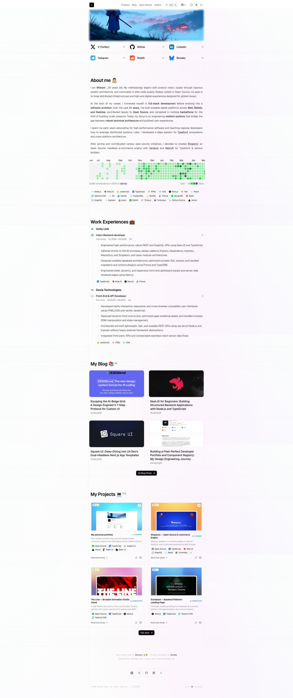

<!--<p align="center">
  
</p>

<h1 align="center">wistant.me — Personal Portfolio & Component Registry</h1>-->

<p align="center">
  My personal digital hub, portfolio, and blog. A space designed to document custom projects, engineering notes, and web development practices, built with high performance and premium developer aesthetics.
</p>

<p align="center">
  <a href="https://wistant.me">🌐 Website</a> ·
  <a href="https://discord.gg/wistant">💬 Discord</a> ·
  <a href="https://github.com/wistant/portfolio/issues">🔊 Report Bug</a>
</p>

---

### Repository Statistics


### Tech Stack & Badges


### NPM Distribution & Downloads


### Community & Sponsors


[](https://wistant.me)

---

## Development Commands

Manage local development, static building, linting, formatting, and sync tasks:

```bash
pnpm dev             # Start the dev server (via Turbopack)
pnpm build           # Production build
pnpm lint            # ESLint
pnpm format:write    # Prettier
pnpm check-types     # TypeScript strict check
pnpm registry:build  # Build the shadcn registry
pnpm push            # Run the release orchestrator (tooling/push.sh)
pnpm sync            # Sync branch with GitHub (tooling/sync.sh)
```

---

## Contributors

Thanks to these amazing developers contributing to this workspace:

<a href="https://github.com/wistant/portfolio/graphs/contributors">
  
</a>

---

## Activity Stats

Development frequency and repository volume tracking:


---

## 📄 License

Licensed under the [GNU License](./LICENSE).

You are free to use, fork, and adapt this project. If you do, please remove personal information before publishing your own version.
