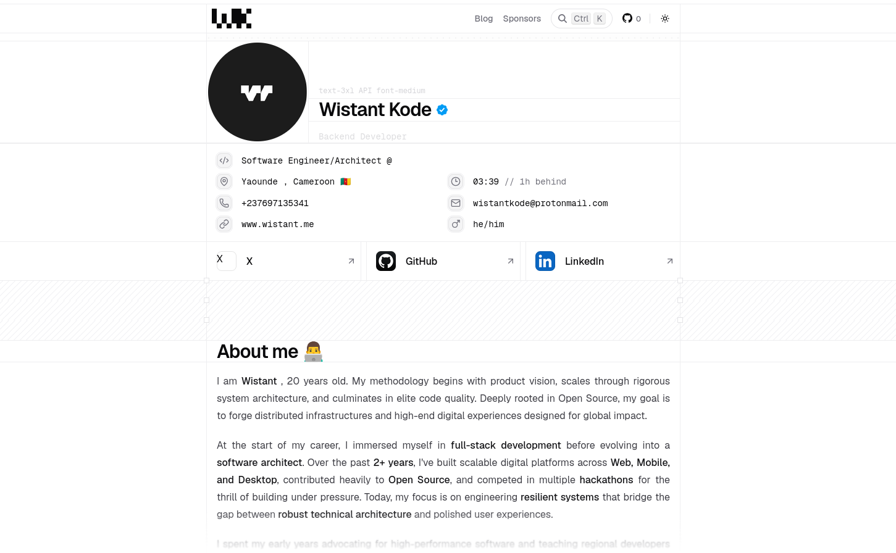

# Wistant Portfolio



<p align="center">
  <a href="https://www.typescriptlang.org/"></a>
  <a href="https://nextjs.org/"></a>
  <a href="https://mdxjs.com/"></a>
  <a href="https://developer.mozilla.org/docs/Web/JavaScript"></a>
  <a href="https://ui.shadcn.com/"></a>
  <a href="https://nextjs.org/docs/app/api-reference/turbopack"></a>
</p>

---

## Development Commands

```bash
pnpm dev             # Start the dev server (Turbopack)
pnpm build           # Production build
pnpm lint            # ESLint
pnpm format:write    # Prettier
pnpm check-types     # TypeScript strict check
pnpm registry:build  # Build the shadcn registry
pnpm push            # Run the release orchestrator (tooling/push.sh)
pnpm sync            # Sync branch with GitHub (tooling/sync.sh)
```

---

## Contributors

<a href="https://github.com/wistant/portfolio/graphs/contributors">
  
</a>

## Stats


---

## License

Licensed under the [GNU License](./LICENSE).

You are free to use, fork, and adapt this project. If you do, please remove my personal information before publishing your own version.
